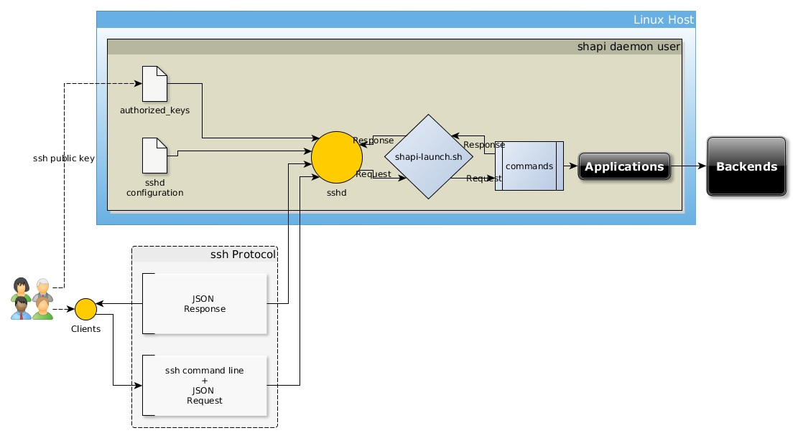

# shapi
Use ssh as transport for JSON-based APIs. (almost REST over ssh)

# Version

Proptyope Edition 0.1.0

# Introduction

In many Linux and Unix sites, [ssh](https://www.openssh.com/) is on all machines and is very trusted. `ssh` is trusted becuase it uses PKI for authentication and strong ciphers for on-the-wire encryption. Every machine runs the `ssh` server/daemon `sshd` and users and automation tools such as [Ansible](https://www.ansible.com/) securely connect from machine to machine to automate many privileged administration tasks. `ssh` is the workhorse of DevOps. Some shops also use ssh-based `scp/sftp` to transfer data files around the organisation. 

Architects who need a client-server system to allow machines to access services remotely typically provide a REST service or microservice solution. This is JSON carried on HTTP(S) and usually they will add JWT for authentication. This requires quite some work - installing web servers, authentication solutions, possible load balancers. Even Kubernetes. For solutions which must scale to millions of transactions it makes perfect sense. However for devops tasks which are low volume this is a significant overhead in labor.

Shapi provides a way to to provide JSON APIs by leveraging our existing ssh networks without the overhead of building a web infrastructure. It's another way to satisfy the [Amazon API Mandate](https://www.google.com/search?q=%22amazon+api+mandate%22).

# Example

Supposing you are a client, you want to access a shapi service for getting data from a user directory service. First you provide your ssh public key to the service administrator. The API documentation provides details of the command to run and the interface. You invoke ssh and supply the command line with the userid:

```
$ echo '{ "userid": "jo" }' | ssh -p 2549 shapiserver user/detail 
```

The service responds with the data on standard out:
```
$ echo '{ "userid": "jo" }' | ssh -p 2549 shapiserver user/detail
{ "userid": "jo",
  "name" : "Jo User",
  "email" : "jo.user@megacorp.com",
 . . .
 }
```

# How It Works



## Rootless ssh Daemon

Normally the ssh daemon is running as the `root` user and only `root` can change its configuration. Since we're most likely to be ordinary users, we don't want root access in order to administer our own ssh world. Luckily for us `openssh` allows ordinary users to run their own limited ssh daemons. shapi provides the configuration files needed to do this. This ssh daemon will need it's own port other than the default port 22. (Of course if you _are_ root an all your systems you can choose to use the system sshd, but that is going to be less secure than running non-root.) 

So we have our own ssh daemon. Let's say we have a user called `shapiuser` who has run up the sshd. sshd allows shells to be spawned running as the `shapiuser` and they can only access the files and resources configure in the operating system. However we don't want the client to run a normal shell session.  

## Forced Commands

The ssh daemon can run particular commands instead of starting an interactice shell. This is via the `ForceCommand` directive. So in our example there is a mapping between `user/detail` and a special script or command which executes the service. shapi provides a framework for launching application programs and passing parameters to them. 

## System Requirements

You will need a 64-bit Linux system with a recent version of `sshd` installed. I have used Centos 7 Debian 9 (Stretch) and Debian 10 (Buster).

# Installation

Installation is from the Git repository at the moment. First login to the userid which will run the daemon (for this document I will use `shapiuser`)). Download a copy of the repository into a directory which will become the runtime dirctory for `shapiuser`.

```
$ git clone git@github.com:birchb1024/shapi.git $HOME
```

# Running

To start the daemon on the default port (2222) run

```
$ shapi/src/shapidctl start
```

To check the server health run

```
$ ssh -T -p 2222 localhost shapi/health
```

To get the list of available services run

```
$ ssh -T -p 2222 localhost shapi/help
```

## Using shapi remotely

First you must add your ssh public key (usually `~/.ssh/id_rsa.pub` to the shapid's authorized keys list
`shapi/daemon/authorized_keys`.

Then issue the ssh command from another machine:

```
$ ssh -T -p 2222 myshapiserver shapi/health
```

## Adding Services

In the prototype you need to edit the file `src/shapi-launcher.sh` and add commands to the case statement. 
For example:

```
  machine/facter)
    stdoutTmpFile=$(mktemp)
    stderrTmpFile=$(mktemp)
    set +e
    if ( facter -j | awk '!/ssh/' | "$script_dir"/../bin/jp '@' ) 1>"$stdoutTmpFile" 2>"$stderrTmpFile"
    then
      cat "$stdoutTmpFile"
    else
      echo "{ \"error\": \"$(cat "$stderrTmpFile" | sed 's;";\";g' )\" }"
      exit 1
    fi
    set -e
    ;;
```

When the Golang version is available, commands will be added by adding code to a YAML configuration file. Handling errors and stderr capture will be automated in Golang.

# Performance

Setting up an ssh session involves quite a bit. There is negotiation of authentication, ciphers, DNS lookups and so on. This is the cost of good security. Without optimisatio connections can take 200 milliseconds, however there are [ways to improve this](https://www.tecmint.com/speed-up-ssh-connections-in-linux/) to around 25 milliseconds depending on your equipment. 

The sshd server is very capable of handling hundreds of simultaneous connections, load capacity is configurable.


# Security

The shapi daemon is openssh daemon with non-root configuration. All processes run in user-space as the shapi user. Linux PAM is disabled since the users are not logging in to the Linux host. shapid enforces ssh key-based login from remote clients. Clients can only access the service if they have a public key uploaded by the administrators.  


# Logging

Shapid activity is logged via `syslog` in a USER stream, for example this appears in `/var/log/messages`:

```Aug 28 18:22:28 shapid[86324]: Received signal 15; terminating.
Aug 28 18:22:31 shapid[38297]: Server listening on 0.0.0.0 port 8080.
Aug 28 18:22:31 shapid[38297]: Server listening on :: port 8080.
Aug 28 18:23:15 shapid[38468]: Accepted publickey for pkginst from 192.168.0.180 port 33700 ssh2: RSA SHA256:RedaCtedRedaCtedRedaCtedRedaCtedRedaCted
Aug 28 18:23:19 shapid[38468]: Received disconnect from 192.168.0.180 port 33700:11: disconnected by user
Aug 28 18:23:19 shapid[38468]: Disconnected from 192.168.0.180 port 33700
```

# Performance

Response time and throughput seem adequate for devops workloads, but probably not for high-volume applications. 

Measuring response time with `$ time ssh -p 8080 pkginst help > /dev/null`   provides timing results

## Response Time

from Centos Desktop VirtualBox VM

    0.16 seconds

from itself

    0.12 seconds

from Windows 10 desktop (git bash)

    0.6 seconds

## Throughput

This is controlled by the `sshd` `MaxSessions` and `MaxStartups` config variables. With these both set to 100, we can have 100 simultaneous sessions.

## Load Test

With 100 max sessions we can run 100 ‘help’ commands in 1.8 seconds from a VirtualBox VM. 

```
$ time seq 100 | parallel -I% --max-args 1 --jobs 100 \
        'ssh -p 8080 pkginst help > /dev/null'
```

    real    0m1.747s

# Roadmap

The initial implementation is programmed in `bash`, this is essentially a prototype and _not_ suitable for exposure to the Internet, however it may be useful within a closed network. The next steps as I see it are:
* Define the protocol (JSON over SSH) including 
  * where clients can find error messages in the reponse,
  * how to pass command-line arguments
  * comprehensive test suite
* Replace all scripted code with GoLang
    * Validate security of GoLang with code analysis tools
    * Provide binaries for Linux 32/64 and ARM 6 and ARM 7(Raspberry Pi)
* Define protocol between shapi and user commands (reminds me of CGI)
  * Provide template sample commands  
* Implement features:
  * Validation that request to and response from commands is valid JSON, fail if not.
  * Provide conversion to/from JSON for commands to standard formats
    * line-based records
    * CSV
    * YAML
    * etc
  * Authorization 
      * User id/Role passthrough to commands
      * Maybe use LDAP for group lookup
  * Public Key Submission access request command for clients. Like [dokku](https://github.com/dokku/sshcommand#commands) provides.
  * Access request CRUD commands for Admin
  * Packaging and Installer

# Help Wanted

Please contact me via GitHub if you would like to contribute to this excellent project. 

# Notes
## Alternative ssh daemons to openssh 
Initially shapi will use the defacto sshd - openssh - mainly becuase it's already installed on most Linux machines we use at my workplace. Later I may add support for the alternatives, these are some of the more interesting options. 
* [sshfront - A lightweight SSH server frontend where authentication and connections are controlled with command handlers / shell scripts.](https://github.com/gliderlabs/sshfront)
* [dropbear - a relatively small SSH server and client.](https://matt.ucc.asn.au/dropbear/dropbear.html)
* [gliderlabs](https://github.com/gliderlabs/ssh)
* [More...](https://en.wikipedia.org/wiki/Comparison_of_SSH_servers)
## Alternatives to shapi

* [dokku/sshcommand](https://github.com/dokku/sshcommand) Simplifies running a single command over SSH, and manages authorized keys (ACL) and users in order to do so.
* [sshapi](sshapi) A bridge from REST to ssh
* 